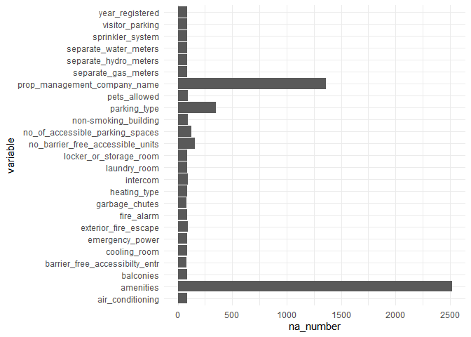
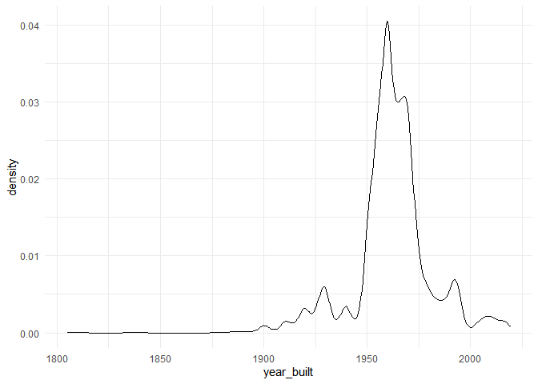
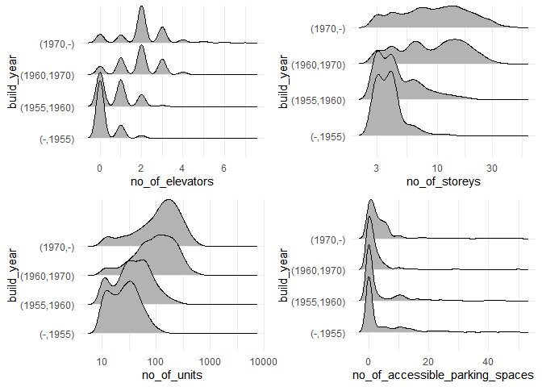
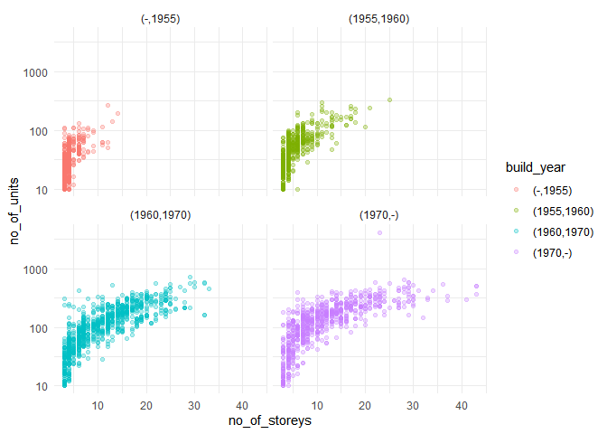
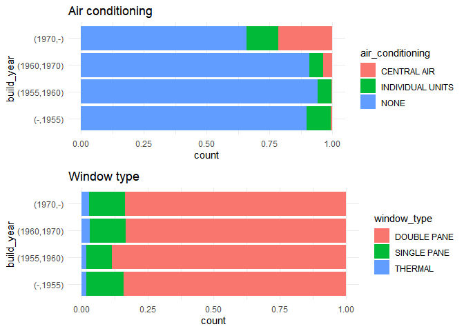
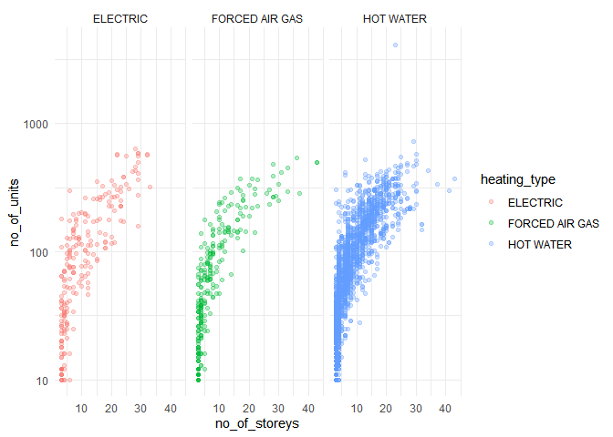
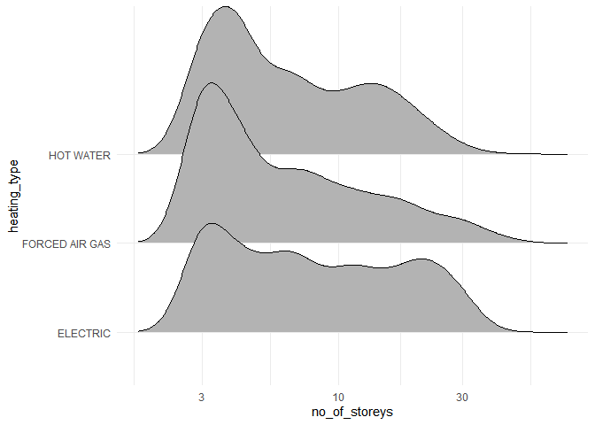

Mini Data-Analysis 1
================

``` r
knitr::opts_chunk$set(error = TRUE)
```

## 1 Select Data

The **datateachr** package have 7 semi-tidy datasets for educational
purposes. I choose four of them first, which is:

1.  apt_buildings
2.  cancer_sample
3.  flow_sample
4.  parking_meters

``` r
library(datateachr)
library(tidyverse)
```

    ## -- Attaching packages --------------------------------------- tidyverse 1.3.1 --

    ## v ggplot2 3.3.5     v purrr   0.3.4
    ## v tibble  3.1.4     v dplyr   1.0.7
    ## v tidyr   1.1.3     v stringr 1.4.0
    ## v readr   2.0.1     v forcats 0.5.1

    ## -- Conflicts ------------------------------------------ tidyverse_conflicts() --
    ## x dplyr::filter() masks stats::filter()
    ## x dplyr::lag()    masks stats::lag()

``` r
library(car)
```

    ## Loading required package: carData

    ## 
    ## Attaching package: 'car'

    ## The following object is masked from 'package:dplyr':
    ## 
    ##     recode

    ## The following object is masked from 'package:purrr':
    ## 
    ##     some

``` r
library("Hmisc")
```

    ## Loading required package: lattice

    ## Loading required package: survival

    ## Loading required package: Formula

    ## 
    ## Attaching package: 'Hmisc'

    ## The following objects are masked from 'package:dplyr':
    ## 
    ##     src, summarize

    ## The following objects are masked from 'package:base':
    ## 
    ##     format.pval, units

``` r
library(easyGgplot2)
```

### attributes of these data

#### Apt_building

`apt_building` contains Toronto apartment building information for
buildings that are registered in the Apartment Building Standard (ABS)
program. WE can see the attributes in following:

Class:

``` r
class(apt_buildings)
```

    ## [1] "tbl_df"     "tbl"        "data.frame"

It is a **tibble** with 3455 rows and 37 columns.

Details:

``` r
glimpse(apt_buildings)
```

    ## Rows: 3,455
    ## Columns: 37
    ## $ id                               <dbl> 10359, 10360, 10361, 10362, 10363, 10~
    ## $ air_conditioning                 <chr> "NONE", "NONE", "NONE", "NONE", "NONE~
    ## $ amenities                        <chr> "Outdoor rec facilities", "Outdoor po~
    ## $ balconies                        <chr> "YES", "YES", "YES", "YES", "NO", "NO~
    ## $ barrier_free_accessibilty_entr   <chr> "YES", "NO", "NO", "YES", "NO", "NO",~
    ## $ bike_parking                     <chr> "0 indoor parking spots and 10 outdoo~
    ## $ exterior_fire_escape             <chr> "NO", "NO", "NO", "YES", "NO", NA, "N~
    ## $ fire_alarm                       <chr> "YES", "YES", "YES", "YES", "YES", "Y~
    ## $ garbage_chutes                   <chr> "YES", "YES", "NO", "NO", "NO", "NO",~
    ## $ heating_type                     <chr> "HOT WATER", "HOT WATER", "HOT WATER"~
    ## $ intercom                         <chr> "YES", "YES", "YES", "YES", "YES", "Y~
    ## $ laundry_room                     <chr> "YES", "YES", "YES", "YES", "YES", "Y~
    ## $ locker_or_storage_room           <chr> "NO", "YES", "YES", "YES", "NO", "YES~
    ## $ no_of_elevators                  <dbl> 3, 3, 0, 1, 0, 0, 0, 2, 4, 2, 0, 2, 2~
    ## $ parking_type                     <chr> "Underground Garage , Garage accessib~
    ## $ pets_allowed                     <chr> "YES", "YES", "YES", "YES", "YES", "Y~
    ## $ prop_management_company_name     <chr> NA, "SCHICKEDANZ BROS. PROPERTIES", N~
    ## $ property_type                    <chr> "PRIVATE", "PRIVATE", "PRIVATE", "PRI~
    ## $ rsn                              <dbl> 4154812, 4154815, 4155295, 4155309, 4~
    ## $ separate_gas_meters              <chr> "NO", "NO", "NO", "NO", "NO", "NO", "~
    ## $ separate_hydro_meters            <chr> "YES", "YES", "YES", "YES", "YES", "Y~
    ## $ separate_water_meters            <chr> "NO", "NO", "NO", "NO", "NO", "NO", "~
    ## $ site_address                     <chr> "65  FOREST MANOR RD", "70  CLIPPER R~
    ## $ sprinkler_system                 <chr> "YES", "YES", "NO", "YES", "NO", "NO"~
    ## $ visitor_parking                  <chr> "PAID", "FREE", "UNAVAILABLE", "UNAVA~
    ## $ ward                             <chr> "17", "17", "03", "03", "02", "02", "~
    ## $ window_type                      <chr> "DOUBLE PANE", "DOUBLE PANE", "DOUBLE~
    ## $ year_built                       <dbl> 1967, 1970, 1927, 1959, 1943, 1952, 1~
    ## $ year_registered                  <dbl> 2017, 2017, 2017, 2017, 2017, NA, 201~
    ## $ no_of_storeys                    <dbl> 17, 14, 4, 5, 4, 4, 4, 7, 32, 4, 4, 7~
    ## $ emergency_power                  <chr> "NO", "YES", "NO", "NO", "NO", "NO", ~
    ## $ `non-smoking_building`           <chr> "YES", "NO", "YES", "YES", "YES", "NO~
    ## $ no_of_units                      <dbl> 218, 206, 34, 42, 25, 34, 14, 105, 57~
    ## $ no_of_accessible_parking_spaces  <dbl> 8, 10, 20, 42, 12, 0, 5, 1, 1, 6, 12,~
    ## $ facilities_available             <chr> "Recycling bins", "Green Bin / Organi~
    ## $ cooling_room                     <chr> "NO", "NO", "NO", "NO", "NO", "NO", "~
    ## $ no_barrier_free_accessible_units <dbl> 2, 0, 0, 42, 0, NA, 14, 0, 0, 1, 25, ~

There are various of character and numeric variables in this dataset.

Missing Data:

``` r
sum(is.na(apt_buildings))
```

    ## [1] 6286

``` r
as_tibble(data.frame(variable=names(apt_buildings),na_number=colSums(is.na(apt_buildings))))
```

    ## # A tibble: 37 x 2
    ##    variable                       na_number
    ##    <chr>                              <dbl>
    ##  1 id                                     0
    ##  2 air_conditioning                      85
    ##  3 amenities                           2518
    ##  4 balconies                             88
    ##  5 barrier_free_accessibilty_entr        82
    ##  6 bike_parking                           0
    ##  7 exterior_fire_escape                  95
    ##  8 fire_alarm                            87
    ##  9 garbage_chutes                        83
    ## 10 heating_type                          86
    ## # ... with 27 more rows

And for all the variables, there are 6286 missing data. When we focus on
each variable, it is obvious that `amenities` and
`prop_management_company_name` have lots of missing data.

#### Cancer_sample

`cancer_sample` contains a sample of quantitative features that were
calculated from images of nuclei present in fine needle aspiration
biopsies of breast masses from patients at the University of Wisconsin
Hospital. WE can see the attributes in following:

Class:

``` r
class(cancer_sample)
```

    ## [1] "spec_tbl_df" "tbl_df"      "tbl"         "data.frame"

It is a **tibble** with 569 rows and 32 columns.

Details:

``` r
glimpse(cancer_sample)
```

    ## Rows: 569
    ## Columns: 32
    ## $ ID                      <dbl> 842302, 842517, 84300903, 84348301, 84358402, ~
    ## $ diagnosis               <chr> "M", "M", "M", "M", "M", "M", "M", "M", "M", "~
    ## $ radius_mean             <dbl> 17.990, 20.570, 19.690, 11.420, 20.290, 12.450~
    ## $ texture_mean            <dbl> 10.38, 17.77, 21.25, 20.38, 14.34, 15.70, 19.9~
    ## $ perimeter_mean          <dbl> 122.80, 132.90, 130.00, 77.58, 135.10, 82.57, ~
    ## $ area_mean               <dbl> 1001.0, 1326.0, 1203.0, 386.1, 1297.0, 477.1, ~
    ## $ smoothness_mean         <dbl> 0.11840, 0.08474, 0.10960, 0.14250, 0.10030, 0~
    ## $ compactness_mean        <dbl> 0.27760, 0.07864, 0.15990, 0.28390, 0.13280, 0~
    ## $ concavity_mean          <dbl> 0.30010, 0.08690, 0.19740, 0.24140, 0.19800, 0~
    ## $ concave_points_mean     <dbl> 0.14710, 0.07017, 0.12790, 0.10520, 0.10430, 0~
    ## $ symmetry_mean           <dbl> 0.2419, 0.1812, 0.2069, 0.2597, 0.1809, 0.2087~
    ## $ fractal_dimension_mean  <dbl> 0.07871, 0.05667, 0.05999, 0.09744, 0.05883, 0~
    ## $ radius_se               <dbl> 1.0950, 0.5435, 0.7456, 0.4956, 0.7572, 0.3345~
    ## $ texture_se              <dbl> 0.9053, 0.7339, 0.7869, 1.1560, 0.7813, 0.8902~
    ## $ perimeter_se            <dbl> 8.589, 3.398, 4.585, 3.445, 5.438, 2.217, 3.18~
    ## $ area_se                 <dbl> 153.40, 74.08, 94.03, 27.23, 94.44, 27.19, 53.~
    ## $ smoothness_se           <dbl> 0.006399, 0.005225, 0.006150, 0.009110, 0.0114~
    ## $ compactness_se          <dbl> 0.049040, 0.013080, 0.040060, 0.074580, 0.0246~
    ## $ concavity_se            <dbl> 0.05373, 0.01860, 0.03832, 0.05661, 0.05688, 0~
    ## $ concave_points_se       <dbl> 0.015870, 0.013400, 0.020580, 0.018670, 0.0188~
    ## $ symmetry_se             <dbl> 0.03003, 0.01389, 0.02250, 0.05963, 0.01756, 0~
    ## $ fractal_dimension_se    <dbl> 0.006193, 0.003532, 0.004571, 0.009208, 0.0051~
    ## $ radius_worst            <dbl> 25.38, 24.99, 23.57, 14.91, 22.54, 15.47, 22.8~
    ## $ texture_worst           <dbl> 17.33, 23.41, 25.53, 26.50, 16.67, 23.75, 27.6~
    ## $ perimeter_worst         <dbl> 184.60, 158.80, 152.50, 98.87, 152.20, 103.40,~
    ## $ area_worst              <dbl> 2019.0, 1956.0, 1709.0, 567.7, 1575.0, 741.6, ~
    ## $ smoothness_worst        <dbl> 0.1622, 0.1238, 0.1444, 0.2098, 0.1374, 0.1791~
    ## $ compactness_worst       <dbl> 0.6656, 0.1866, 0.4245, 0.8663, 0.2050, 0.5249~
    ## $ concavity_worst         <dbl> 0.71190, 0.24160, 0.45040, 0.68690, 0.40000, 0~
    ## $ concave_points_worst    <dbl> 0.26540, 0.18600, 0.24300, 0.25750, 0.16250, 0~
    ## $ symmetry_worst          <dbl> 0.4601, 0.2750, 0.3613, 0.6638, 0.2364, 0.3985~
    ## $ fractal_dimension_worst <dbl> 0.11890, 0.08902, 0.08758, 0.17300, 0.07678, 0~

Nearly all of these variables are numeric, instead of `diagnosis` which
is a **Binary variable**.

Missing Data:

``` r
sum(is.na(cancer_sample))
```

    ## [1] 0

``` r
as_tibble(data.frame(variable=names(cancer_sample),na_number=colSums(is.na(cancer_sample))))
```

    ## # A tibble: 32 x 2
    ##    variable            na_number
    ##    <chr>                   <dbl>
    ##  1 ID                          0
    ##  2 diagnosis                   0
    ##  3 radius_mean                 0
    ##  4 texture_mean                0
    ##  5 perimeter_mean              0
    ##  6 area_mean                   0
    ##  7 smoothness_mean             0
    ##  8 compactness_mean            0
    ##  9 concavity_mean              0
    ## 10 concave_points_mean         0
    ## # ... with 22 more rows

For all the variables, there is no missing data.

#### Flow_sample

`flow_sample` contains a sample of historical flow rate extreme data
collected by the Government of Canada at station 05BB001. WE can see the
attributes in following:

Class:

``` r
class(flow_sample)
```

    ## [1] "tbl_df"     "tbl"        "data.frame"

It is a **tibble** with 218 rows and 7 columns.

Details:

``` r
glimpse(flow_sample)
```

    ## Rows: 218
    ## Columns: 7
    ## $ station_id   <chr> "05BB001", "05BB001", "05BB001", "05BB001", "05BB001", "0~
    ## $ year         <dbl> 1909, 1910, 1911, 1912, 1913, 1914, 1915, 1916, 1917, 191~
    ## $ extreme_type <chr> "maximum", "maximum", "maximum", "maximum", "maximum", "m~
    ## $ month        <dbl> 7, 6, 6, 8, 6, 6, 6, 6, 6, 6, 6, 7, 6, 6, 6, 7, 5, 7, 6, ~
    ## $ day          <dbl> 7, 12, 14, 25, 11, 18, 27, 20, 17, 15, 22, 3, 9, 5, 14, 5~
    ## $ flow         <dbl> 314, 230, 264, 174, 232, 214, 236, 309, 174, 345, 185, 24~
    ## $ sym          <chr> NA, NA, NA, NA, NA, NA, NA, NA, NA, NA, NA, NA, NA, NA, N~

There are three characteristic and four numeric variables.

Missing Data:

``` r
sum(is.na(flow_sample))
```

    ## [1] 125

``` r
as_tibble(data.frame(variable=names(flow_sample),na_number=colSums(is.na(flow_sample))))
```

    ## # A tibble: 7 x 2
    ##   variable     na_number
    ##   <chr>            <dbl>
    ## 1 station_id           0
    ## 2 year                 0
    ## 3 extreme_type         0
    ## 4 month                2
    ## 5 day                  2
    ## 6 flow                 2
    ## 7 sym                119

For all the variables, there are 125 missing data, and nearly all of
them are caused by `sym`.

#### Parking_meters

`parking_meters` contains information on the rates and time limits for
parking meters in Vancouver. WE can see the attributes in following:

Class:

``` r
class(parking_meters)
```

    ## [1] "tbl_df"     "tbl"        "data.frame"

It is a **tibble** with 10032 rows and 22 columns.

Details:

``` r
glimpse(parking_meters)
```

    ## Rows: 10,032
    ## Columns: 22
    ## $ meter_head     <chr> "Twin", "Pay Station", "Twin", "Single", "Twin", "Twin"~
    ## $ r_mf_9a_6p     <chr> "$2.00", "$1.00", "$1.00", "$1.00", "$2.00", "$2.00", "~
    ## $ r_mf_6p_10     <chr> "$4.00", "$1.00", "$1.00", "$1.00", "$1.00", "$1.00", "~
    ## $ r_sa_9a_6p     <chr> "$2.00", "$1.00", "$1.00", "$1.00", "$2.00", "$2.00", "~
    ## $ r_sa_6p_10     <chr> "$4.00", "$1.00", "$1.00", "$1.00", "$1.00", "$1.00", "~
    ## $ r_su_9a_6p     <chr> "$2.00", "$1.00", "$1.00", "$1.00", "$2.00", "$2.00", "~
    ## $ r_su_6p_10     <chr> "$4.00", "$1.00", "$1.00", "$1.00", "$1.00", "$1.00", "~
    ## $ rate_misc      <chr> NA, "$ .50", NA, NA, NA, NA, NA, NA, NA, NA, NA, NA, NA~
    ## $ time_in_effect <chr> "METER IN EFFECT: 9:00 AM TO 10:00 PM", "METER IN EFFEC~
    ## $ t_mf_9a_6p     <chr> "2 Hr", "10 Hrs", "2 Hr", "2 Hr", "2 Hr", "3 Hr", "2 Hr~
    ## $ t_mf_6p_10     <chr> "4 Hr", "10 Hrs", "4 Hr", "4 Hr", "4 Hr", "4 Hr", "4 Hr~
    ## $ t_sa_9a_6p     <chr> "2 Hr", "10 Hrs", "2 Hr", "2 Hr", "2 Hr", "3 Hr", "2 Hr~
    ## $ t_sa_6p_10     <chr> "4 Hr", "10 Hrs", "4 Hr", "4 Hr", "4 Hr", "4 Hr", "4 Hr~
    ## $ t_su_9a_6p     <chr> "2 Hr", "10 Hrs", "2 Hr", "2 Hr", "2 Hr", "3 Hr", "2 Hr~
    ## $ t_su_6p_10     <chr> "4 Hr", "10 Hrs", "4 Hr", "4 Hr", "4 Hr", "4 Hr", "4 Hr~
    ## $ time_misc      <chr> NA, "No Time Limit", NA, NA, NA, NA, NA, NA, NA, NA, NA~
    ## $ credit_card    <chr> "No", "Yes", "No", "No", "No", "No", "No", "No", "No", ~
    ## $ pay_phone      <chr> "66890", "59916", "57042", "57159", "51104", "60868", "~
    ## $ longitude      <dbl> -123.1289, -123.0982, -123.1013, -123.1862, -123.1278, ~
    ## $ latitude       <dbl> 49.28690, 49.27215, 49.25468, 49.26341, 49.26354, 49.27~
    ## $ geo_local_area <chr> "West End", "Strathcona", "Riley Park", "West Point Gre~
    ## $ meter_id       <chr> "670805", "471405", "C80145", "D03704", "301023", "5913~

There are various of character and numeric variables.

Missing Data:

``` r
sum(is.na(parking_meters))
```

    ## [1] 19096

``` r
as_tibble(data.frame(variable=names(parking_meters),na_number=colSums(is.na(parking_meters))))
```

    ## # A tibble: 22 x 2
    ##    variable       na_number
    ##    <chr>              <dbl>
    ##  1 meter_head             0
    ##  2 r_mf_9a_6p            20
    ##  3 r_mf_6p_10            20
    ##  4 r_sa_9a_6p            23
    ##  5 r_sa_6p_10            20
    ##  6 r_su_9a_6p            23
    ##  7 r_su_6p_10            20
    ##  8 rate_misc           9218
    ##  9 time_in_effect        37
    ## 10 t_mf_9a_6p            29
    ## # ... with 12 more rows

And for all the variables, there are 19096 missing data. When we focus
on each variable, it is obvious that `rate_misc` (who has 9218 missing
data) and `time_misc` (who has 9551 missing data) contributes to that.

For each of these data, I would like to explore the following:

1.  In `apt_buildings`: How do the number of elevators, storeys, units
    and accessible parking spaces change as time goes on?
2.  In `cancer_sample`: What’s the relationship between diagnosis and
    the mean of something, like radius_mean, texture_mean,
    perimeter_mean…
3.  In `flow_sample`: Does the flow rate have periodically change with
    years or month?
4.  In `parking_meters`: Does the rate will be different for different
    time limits, and for different meter_head?

## 2 Narrow down to 2 datasets

I will not choose `flow_sample` for there are not many variables in this
data and in the same time, for variable `sym`, there are many missing
data, which let me think this variable is not useful in analysis. I
discard `cancer_sample data`, since there is just one binary variable. I
am interested in apartment buildings and would like to explore it. I
would like to know whether as time goes on, the facilities of buildings
would change and what are the relationships between different variables.

## 3 Explore `apt_buildings`

### Clean Data

We can now show the variables with larger than 80 missing data, the
histogram shows:

``` r
na_apt <- as_tibble(data.frame(variable=names(apt_buildings),na_number=colSums(is.na(apt_buildings))))
na_apt %>% filter(na_number>=80) %>% ggplot()+
  geom_bar(aes(x =variable, y = na_number), stat = "identity")+
  theme_minimal()+
  coord_flip()
```

<!-- -->

Considering the amount of data and the proportion of missing values, I
will discard variable `amenities` and `prop_management_company_name`.

``` r
apt_buildings %>% ggplot(aes(year_built))+
  geom_density()+
  theme_minimal()
```

    ## Warning: Removed 13 rows containing non-finite values (stat_density).

<!-- -->

It is clear that the built years are mainly between 1950 and 1960. I
create new variable named `build_year` which splits `year_built` into
four parts: before 1955, between 1955 and 1960, between 1960 and 1970
and after 1970. All rows with missing data are deleted. A new data names
apt_buildings1 is developed.

``` r
apt_buildings1 <- apt_buildings %>% select(-amenities,-prop_management_company_name) %>% 
  mutate(build_year=ifelse(year_built<=1970,ifelse(year_built<=1960,ifelse(year_built<=1955,"(-,1955)","(1955,1960)"),"(1960,1970)"),"(1970,-)"))

apt_buildings1<- na.omit(apt_buildings1)
#table(apt_buildings1$build_year)
glimpse(apt_buildings1)
```

    ## Rows: 3,010
    ## Columns: 36
    ## $ id                               <dbl> 10359, 10360, 10361, 10362, 10363, 10~
    ## $ air_conditioning                 <chr> "NONE", "NONE", "NONE", "NONE", "NONE~
    ## $ balconies                        <chr> "YES", "YES", "YES", "YES", "NO", "NO~
    ## $ barrier_free_accessibilty_entr   <chr> "YES", "NO", "NO", "YES", "NO", "YES"~
    ## $ bike_parking                     <chr> "0 indoor parking spots and 10 outdoo~
    ## $ exterior_fire_escape             <chr> "NO", "NO", "NO", "YES", "NO", "NO", ~
    ## $ fire_alarm                       <chr> "YES", "YES", "YES", "YES", "YES", "Y~
    ## $ garbage_chutes                   <chr> "YES", "YES", "NO", "NO", "NO", "NO",~
    ## $ heating_type                     <chr> "HOT WATER", "HOT WATER", "HOT WATER"~
    ## $ intercom                         <chr> "YES", "YES", "YES", "YES", "YES", "Y~
    ## $ laundry_room                     <chr> "YES", "YES", "YES", "YES", "YES", "Y~
    ## $ locker_or_storage_room           <chr> "NO", "YES", "YES", "YES", "NO", "YES~
    ## $ no_of_elevators                  <dbl> 3, 3, 0, 1, 0, 0, 2, 4, 2, 0, 2, 2, 2~
    ## $ parking_type                     <chr> "Underground Garage , Garage accessib~
    ## $ pets_allowed                     <chr> "YES", "YES", "YES", "YES", "YES", "Y~
    ## $ property_type                    <chr> "PRIVATE", "PRIVATE", "PRIVATE", "PRI~
    ## $ rsn                              <dbl> 4154812, 4154815, 4155295, 4155309, 4~
    ## $ separate_gas_meters              <chr> "NO", "NO", "NO", "NO", "NO", "NO", "~
    ## $ separate_hydro_meters            <chr> "YES", "YES", "YES", "YES", "YES", "Y~
    ## $ separate_water_meters            <chr> "NO", "NO", "NO", "NO", "NO", "NO", "~
    ## $ site_address                     <chr> "65  FOREST MANOR RD", "70  CLIPPER R~
    ## $ sprinkler_system                 <chr> "YES", "YES", "NO", "YES", "NO", "NO"~
    ## $ visitor_parking                  <chr> "PAID", "FREE", "UNAVAILABLE", "UNAVA~
    ## $ ward                             <chr> "17", "17", "03", "03", "02", "02", "~
    ## $ window_type                      <chr> "DOUBLE PANE", "DOUBLE PANE", "DOUBLE~
    ## $ year_built                       <dbl> 1967, 1970, 1927, 1959, 1943, 1959, 1~
    ## $ year_registered                  <dbl> 2017, 2017, 2017, 2017, 2017, 2017, 2~
    ## $ no_of_storeys                    <dbl> 17, 14, 4, 5, 4, 4, 7, 32, 4, 4, 7, 5~
    ## $ emergency_power                  <chr> "NO", "YES", "NO", "NO", "NO", "NO", ~
    ## $ `non-smoking_building`           <chr> "YES", "NO", "YES", "YES", "YES", "NO~
    ## $ no_of_units                      <dbl> 218, 206, 34, 42, 25, 14, 105, 571, 1~
    ## $ no_of_accessible_parking_spaces  <dbl> 8, 10, 20, 42, 12, 5, 1, 1, 6, 12, 0,~
    ## $ facilities_available             <chr> "Recycling bins", "Green Bin / Organi~
    ## $ cooling_room                     <chr> "NO", "NO", "NO", "NO", "NO", "NO", "~
    ## $ no_barrier_free_accessible_units <dbl> 2, 0, 0, 42, 0, 14, 0, 0, 1, 25, 0, 0~
    ## $ build_year                       <chr> "(1960,1970)", "(1960,1970)", "(-,195~

### Questions

1.  How do the number of elevators, storeys, units and accessible
    parking spaces change as time goes on?

``` r
p_elevator = apt_buildings1 %>% filter(no_of_elevators<=10) %>%
  ggplot(aes(x = no_of_elevators, y=build_year)) +
  ggridges::geom_density_ridges()+
  #scale_x_log10()+
  theme_minimal()

p_storeys =apt_buildings1 %>%  
  ggplot(aes(x = no_of_storeys, y=build_year)) +
  ggridges::geom_density_ridges()+
  scale_x_log10()+
  theme_minimal()

p_units = ggplot(apt_buildings1,aes(x = no_of_units, y =build_year)) +
  ggridges::geom_density_ridges()+
  scale_x_log10()+
  theme_minimal()

p_accessible_parking_spaces =apt_buildings1 %>% filter(no_of_accessible_parking_spaces<=50) %>% 
  ggplot(aes(x = no_of_accessible_parking_spaces, y =build_year)) +
  ggridges::geom_density_ridges()+
  theme_minimal()

ggplot2.multiplot(p_elevator, p_storeys, p_units, p_accessible_parking_spaces)
```

    ## Picking joint bandwidth of 0.185

    ## Picking joint bandwidth of 0.0509

    ## Picking joint bandwidth of 0.0821

    ## Picking joint bandwidth of 1

<!-- -->

As time goes on, the number of elevators, storeys ,units and accessible
parking spaces are become more and more. Compared with accessible
parking spaces, the changes of elevators, storeys ,units are more
obvious. It is obvious to see that the number of storeys are larger than
before, more higher buildings after 1960. And it is also clear that as
time goes on, units became to be more and more. For elevators, before
1960, the change is obvious, but after that the change of number with
time goes on is not obvious. For accessible parking spaces, after 1970,
there is begin to have a change.

2.  The relationship between the number of units and storeys.

``` r
ggplot(apt_buildings1)+
  geom_point(aes(no_of_storeys,no_of_units,color=build_year),alpha=0.3)+
  scale_y_log10()+
  facet_wrap(~build_year)+
  theme_minimal()
```

<!-- -->

Before 1955, the number of storeys tend to be less than five with there
are various number of units. However later, especially after 1960, there
are more and more storeys and units. The change rate of units is not as
fast as storeys, which shows in the graph that as the number of storeys
larger, the number of units is nearly not change.

``` r
b_air <- ggplot(apt_buildings1) + 
  geom_bar(mapping = aes(build_year, fill = air_conditioning), position = "fill")+
  theme_minimal()+
  ggtitle("Air conditioning")+
  coord_flip()

b_window <- ggplot(apt_buildings1) + 
  geom_bar(mapping = aes(build_year, fill = window_type), position = "fill")+
  theme_minimal()+
  ggtitle("Window type")+
  coord_flip()
ggplot2.multiplot(b_air,b_window,cols=1)
```

<!-- -->

Depending on the graph above, we can see that compared with window, the
type of air conditioning change more obviously during time goes on. For
air conditioning, besides having no air conditioning, individual units
tend to have more than central air. Later, individual units reduce and
central air become more and more. For window type however, the change do
not obvious and double pane always be the most popular type.

3.  Do the heating type change with different units and different
    storeys?

``` r
ggplot(apt_buildings1)+
  geom_point(aes(no_of_storeys,no_of_units,color=heating_type),alpha=0.3)+
  scale_y_log10()+
  theme_minimal()+
  facet_wrap(~heating_type)
```

<!-- -->

We would like to know whether as the number of units and storeys
changes, the heating type will change. On the graph above, it is obvious
that hot water is the most popular type. As the number of units
changing, there is no discernible difference about the type of heating.
But there might have some link with the number of storeys and the
heating type. Hence the following density ridge created:

``` r
ggplot(apt_buildings1,aes(no_of_storeys,heating_type))+
  ggridges::geom_density_ridges()+
  scale_x_log10()+
  theme_minimal()
```

    ## Picking joint bandwidth of 0.0818

<!-- -->

Now it is clear that for buildings with lower storeys, there is less
differences between heating types. For buildings with higher storeys,
electric and hot water is more popular than forced air gas.

## 4 Research qustions

With the exploration above, I would like to ask the following questions:

1.  For the Toronto Apartment Building built after 1970 with air
    conditioning, does the heating type have a relationship with the
    built year?
2.  For the Toronto Apartment Building with more than one accessible
    parking space and visitor parking space, what’s the relationship
    between the number of accessible parking spaces and visitor parking
    available?
3.  For the Toronto Apartment Building built after 1970 with more than
    one elevators, does the number of elevators and the number of
    storeys have a positive relationship?
4.  With different number of storeys and units, does the window type
    have some characteristic?
