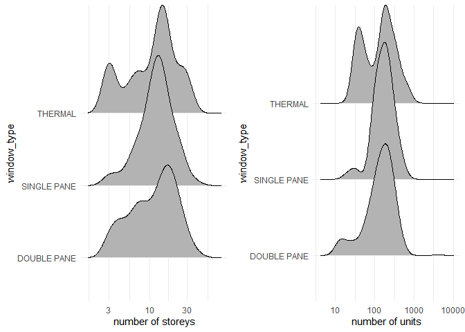
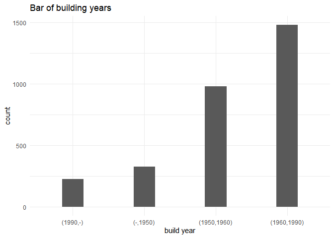
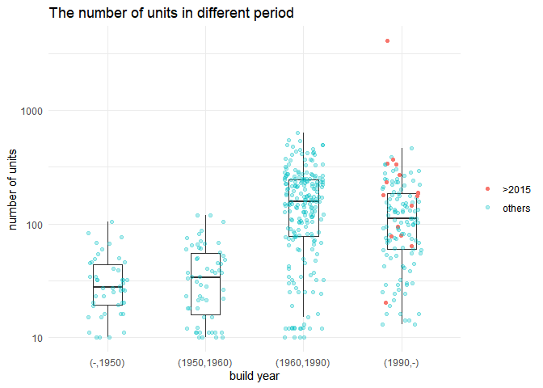
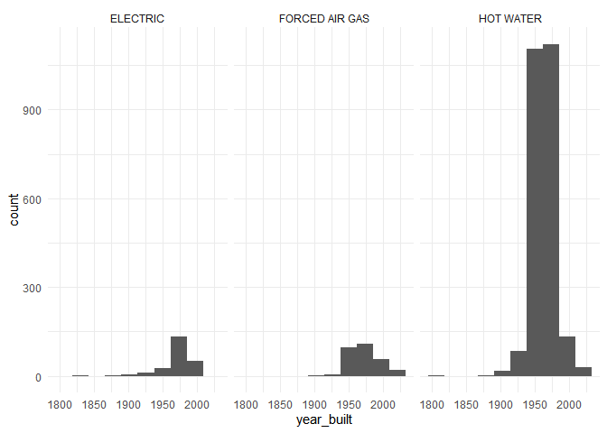
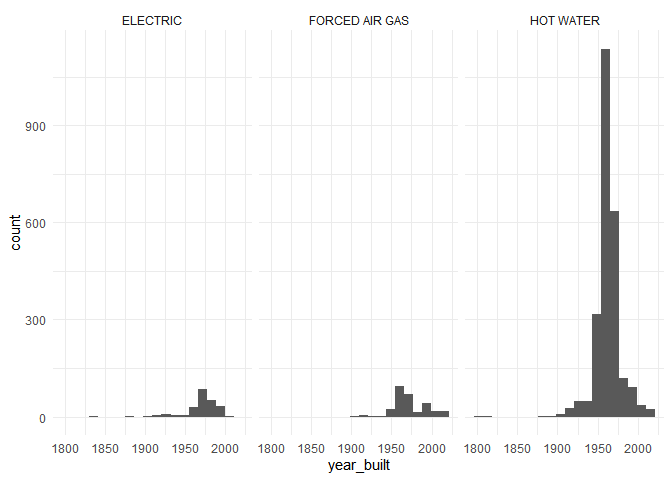
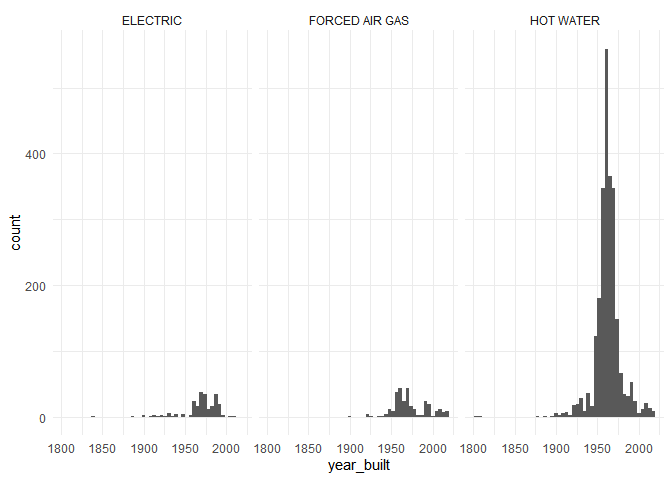
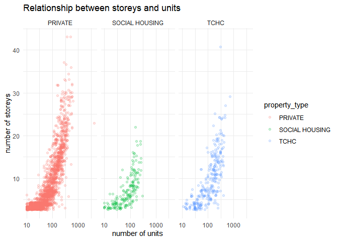

Mini Data Analysis Milestone 2
================

*To complete this milestone, you can either edit [this `.rmd`
file](https://raw.githubusercontent.com/UBC-STAT/stat545.stat.ubc.ca/master/content/mini-project/mini-project-2.Rmd)
directly. Fill in the sections that are commented out with
`<!--- start your work here--->`. When you are done, make sure to knit
to an `.md` file by changing the output in the YAML header to
`github_document`, before submitting a tagged release on canvas.*

# Welcome back to your mini data analysis project!

This time, we will explore more in depth the concept of *tidy data*, and
hopefully investigate further into your research questions that you
defined in milestone 1.

**NOTE**: The main purpose of the mini data analysis is to integrate
what you learn in class in an analysis. Although each milestone provides
a framework for you to conduct your analysis, it’s possible that you
might find the instructions too rigid for your data set. If this is the
case, you may deviate from the instructions – just make sure you’re
demonstrating a wide range of tools and techniques taught in this class.

Begin by loading your data and the tidyverse package below:

``` r
library(datateachr) # <- might contain the data you picked!
library(tidyverse)
library(easyGgplot2)
library(Rmisc)
```

# Learning Objectives

By the end of this milestone, you should:

-   Become familiar with manipulating and summarizing your data in
    tibbles using `dplyr` and `tidyr`, with a research question in mind.
-   Understand what *tidy* data is, and how to create it. In milestone
    3, we will explore when this might be useful.
-   Generate a reproducible and clear report using R Markdown.
-   Gain a greater understanding of how to use R to answer research
    questions about your data.

**Things to keep in mind**

-   Remember to document your code, be explicit about what you are
    doing, and write notes in this markdown document when you feel that
    context is required. Create your analysis as if someone else will be
    reading it! **There will be 2.5 points reserved for reproducibility,
    readability, and repo organization.**

-   Before working on each task, you should always keep in mind the
    specific **research question** that you’re trying to answer.

# Task 1: Process and summarize your data (15 points)

From milestone 1, you should have an idea of the basic structure of your
dataset (e.g. number of rows and columns, class types, etc.). Here, we
will start investigating your data more in-depth using various data
manipulation functions.

### 1.1 (2.5 points)

First, write out the 4 research questions you defined in milestone 1
were. This will guide your work through milestone 2:

<!-------------------------- Start your work below ---------------------------->

By collecting data logically,and in order to finish the tasks in mda2
effectively, I edited the questions I showed in mda1. These are the four
questions I want to solve in this analysis:

1.  *Does the number of units and the number of storeys have different
    relationships under different window types*

2.  *For the Toronto Apartment Building with air conditioning, does the
    number of units change during period (built before 1950, between
    1950 and 1960, between 1960 and 1990 and after 1990)?*

3.  *For the Toronto Apartment Building, does the heating type change
    during period (built before 1950, between 1950 and 1960, between
    1960 and 1990 and after 1990)?*

4.  *For the Toronto Apartment Building built with intercom system, does
    the number of units and the number of storeys have a relationship
    under different property types?*
    <!----------------------------------------------------------------------------->

### 1.2 (10 points)

Now, for each of your four research questions, choose one task from
options 1-4 (summarizing), and one other task from 4-8 (graphing). You
should have 2 tasks done for each research question (8 total). Make sure
it makes sense to do them! (e.g. don’t use a numerical variables for a
task that needs a categorical variable.). Comment on why each task helps
(or doesn’t!) answer the corresponding research question.

Ensure that the output of each operation is printed!

**Summarizing:**

1.  Compute the *range*, *mean*, and *two other summary statistics* of
    **one numerical variable** across the groups of **one categorical
    variable** from your data.
2.  Compute the number of observations for at least one of your
    categorical variables. Do not use the function `table()`!
3.  Create a categorical variable with 3 or more groups from an existing
    numerical variable. You can use this new variable in the other
    tasks! *An example: age in years into “child, teen, adult, senior”.*
4.  Based on two categorical variables, calculate two summary statistics
    of your choosing.

**Graphing:**

5.  Create a graph out of summarized variables that has at least two
    geom layers.
6.  Create a graph of your choosing, make one of the axes logarithmic,
    and format the axes labels so that they are “pretty” or easier to
    read.
7.  Make a graph where it makes sense to customize the alpha
    transparency.
8.  Create 3 histograms out of summarized variables, with each histogram
    having different sized bins. Pick the “best” one and explain why it
    is the best.

Make sure it’s clear what research question you are doing each operation
for!

<!------------------------- Start your work below ----------------------------->
<!----------------------------------------------------------------------------->

#### question1: *Does the number of units and the number of storeys have different relationships under different window types*

First, exploring the mean, range, standard deviation and median of the
number of units and storeys under different window types.

``` r
apt_buildings %>%
 drop_na() %>% 
 group_by(window_type) %>%
 dplyr::summarise(storeys_mean = mean(no_of_units),
           units_mean=mean(no_of_storeys))
```

    ## # A tibble: 3 x 3
    ##   window_type storeys_mean units_mean
    ##   <chr>              <dbl>      <dbl>
    ## 1 DOUBLE PANE         178.       13.3
    ## 2 SINGLE PANE         190.       13.3
    ## 3 THERMAL             181.       13

From the table, it is obvious that the mean of the storeys changes with
different types of windows and buildings with ‘*SINGLE PANE*’ have the
most largest number of storeys. However, the change of units mean with
different window types is not obvious.

``` r
apt_buildings %>%
 drop_na() %>% 
 group_by(window_type) %>%
 dplyr::summarise(storeys_range=range(no_of_units),
           units_range=range(no_of_storeys))
```

    ## `summarise()` has grouped output by 'window_type'. You can override using the `.groups` argument.

    ## # A tibble: 6 x 3
    ## # Groups:   window_type [3]
    ##   window_type storeys_range units_range
    ##   <chr>               <dbl>       <dbl>
    ## 1 DOUBLE PANE            10           3
    ## 2 DOUBLE PANE          4111          43
    ## 3 SINGLE PANE            20           3
    ## 4 SINGLE PANE           547          37
    ## 5 THERMAL                34           3
    ## 6 THERMAL               638          30

From the table, it is obvious that the minimum value and the maximum
value of the storeys change with different types of windows. For the
units, the minimum value does not change for different window types but
the maximum value changes.

``` r
apt_buildings %>%
 drop_na() %>% 
 group_by(window_type) %>%
 dplyr::summarise(storeys_sd=sd(no_of_units),
           units_sd=sd(no_of_storeys))
```

    ## # A tibble: 3 x 3
    ##   window_type storeys_sd units_sd
    ##   <chr>            <dbl>    <dbl>
    ## 1 DOUBLE PANE       215.     7.91
    ## 2 SINGLE PANE       105.     6.34
    ## 3 THERMAL           160.     8.26

From the table, the standard deviation of storeys and units with
different window types change clearly. The number of storey with
‘*DOUBLE PANE*’ spreads out across a wider range and the number of unit
with ‘*THERMAL*’ spreads out across a wider range.

``` r
apt_buildings %>%
 drop_na() %>% 
 group_by(window_type) %>%
 dplyr::summarise(storeys_median=median(no_of_units),
           units_median=median(no_of_storeys))
```

    ## # A tibble: 3 x 3
    ##   window_type storeys_median units_median
    ##   <chr>                <dbl>        <dbl>
    ## 1 DOUBLE PANE           152.           13
    ## 2 SINGLE PANE           174            13
    ## 3 THERMAL               174            14

From the table, storeys median with ‘*DOUBLE PANE*’ is the least. Units
median with different window types changes little.

``` r
apt_buildings %>%
 drop_na() %>% 
 ggplot()+
 geom_point(aes(no_of_storeys,no_of_units,color=window_type),alpha=0.3)+
 scale_y_log10("number of units")+
 xlab("number of storeys")+
 theme_minimal()+
 ggtitle("Relationship between units and storeys")+
 facet_wrap(~window_type)
```

<!-- -->

The graph shows ‘*DOUBLE PANE*’ is the most popular window type. For
units less than 50, ‘*DOUBLE PANE*’ is nearly the only choice. ‘*SINGLE
PANE*’ and ‘*DOUBLE PANE*’ tend to be used in buildings with more units.
The relationship between the number of units and the number of storeys
changes with different window types.

``` r
p_units=apt_buildings %>%
 drop_na() %>% 
 ggplot(aes(no_of_units,window_type))+
 ggridges::geom_density_ridges()+
 scale_x_log10("number of units")+
 theme_minimal()
p_storeys=apt_buildings %>%
 drop_na() %>% 
 ggplot(aes(no_of_storeys,window_type))+
 ggridges::geom_density_ridges()+
 scale_x_log10("number of storeys")+
 theme_minimal()
ggplot2.multiplot(p_storeys, p_units)
```

    ## Picking joint bandwidth of 0.0913

    ## Picking joint bandwidth of 0.128

<!-- -->

The graphs above show the distribution of units and storeys with
different types of windows. For different window types, the distribution
of the number of storeys is obviously different. The distributions of
the number of units with ‘*SINGLE PANE*’ and ‘*DOUBLE PANE*’ are
similar.

#### question2: For the Toronto Apartment Building without air conditioning, does the number of units change during period (built before 1950, between 1950 and 1960, between 1960 and 1990 and after 1990)

First, creating a new column, grouping the `year_built` to four groups:
built before 1950, between 1950 and 1960, between 1960 and 1990 and
after 1990.And the number of buildings in each group shows in the
following graph.

``` r
apt_buildings2 <- apt_buildings %>% 
 select(-amenities,-prop_management_company_name) %>% 
 mutate(build_year=case_when(year_built<=1950 ~ "(-,1950)",
                             year_built<=1960 ~ "(1950,1960)",
                             year_built<=1990 ~ "(1960,1990)",
                             TRUE ~ "(1990,-)"))
apt_buildings2<- drop_na(apt_buildings2)

apt_buildings2 %>% 
 mutate(build_year = fct_rev(fct_infreq(build_year)))%>% 
 ggplot()+
 geom_bar(aes(build_year),width = 0.3)+
 ggtitle("Bar of building years")+
 xlab("build year")+
 theme_minimal()
```

<!-- -->

``` r
apt_buildings2 %>% 
 filter(air_conditioning!="NONE")%>% 
 mutate(o2010=if_else(year_built>"2015", ">2015","others")) %>% 
 ggplot(aes(x = build_year,y=no_of_units)) +
 scale_y_log10("number of units")+
 geom_boxplot(outlier.shape=NA,width=0.3)+
 geom_jitter(aes(color=o2010,alpha=o2010),width=0.2)+
 theme_minimal()+
 xlab("build year")+
 ggtitle("The number of units in different period")+
 scale_color_discrete("")+
 scale_alpha_manual("",values=c(1,0.3))
```

<!-- -->

In the graph, it is clear that as time goes on, the number of units
growing up, especially from 1960. After 1990, the number of units
decreased a little in general. However, when highlighting the buildings
built after 2015(orange points), it is clear that the number of units
after 2015 is random.

#### question3: For the Toronto Apartment Building, does the heating type change during period (built before 1950, between 1950 and 1960, between 1960 and 1990 and after 1990)?

``` r
apt_buildings2 %>%
 group_by(heating_type) %>% 
 dplyr::summarise(number=n())
```

    ## # A tibble: 3 x 2
    ##   heating_type   number
    ##   <chr>           <int>
    ## 1 ELECTRIC          226
    ## 2 FORCED AIR GAS    289
    ## 3 HOT WATER        2495

It is clear that *HOT WATER* is the most popular heating type.

``` r
dodge <- apt_buildings2 %>%
 ggplot(aes(build_year,fill=heating_type))+
 geom_bar(position="dodge")+
 theme_minimal()+
 theme(legend.position = "none")+
 xlab("build year")+
 coord_flip()

identity<- apt_buildings2 %>%
 ggplot(aes(build_year,fill=heating_type))+
 geom_bar(position="identity")+
 theme_minimal()+
 theme(legend.position = "none")+
 xlab("build year")+
 coord_flip()

fill<- apt_buildings2 %>%
 ggplot(aes(build_year,fill=heating_type))+
 geom_bar(position="fill")+
 theme_minimal()+
 xlab("build year")+
 coord_flip()

layout <- matrix(c(1,2,3,3),2,2,byrow=TRUE)
multiplot(dodge,identity,fill,layout=layout)
```

<!-- -->

It is better to choose the last histogram. Because this makes each set
of stacked bars the same height and makes it easier to compare
proportions across groups. ‘*HOT WATER*’ is the most popular heating
type. As time goes on, ‘*FORCED AIR GAS*’ becomes popular.

Then I draw three histogram to choose the best one:

``` r
apt_buildings2 %>%
 ggplot(aes(year_built))+
 geom_histogram(bins = 10)+
 theme_minimal()+
 facet_wrap(~heating_type)
```

<!-- -->

``` r
apt_buildings2 %>%
 ggplot(aes(year_built))+
 geom_histogram(bins = 20)+
 theme_minimal()+
 facet_wrap(~heating_type)
```

<!-- -->

``` r
apt_buildings2 %>%
 ggplot(aes(year_built))+
 geom_histogram(bins = 50)+
 theme_minimal()+
 facet_wrap(~heating_type)
```

<!-- -->

These three histograms shows the same questions with different sized
bins. We can see that the distribution of different types of heating are
differently. I will choose the last graph, because with larger bins, it
shows more clear about the each distribution.

#### question4: For the Toronto Apartment Building built with intercom system, does the number of units and the number of storeys have a relationship under different property type?

``` r
apt_buildings2 %>%
 group_by(intercom, property_type) %>% 
 dplyr::summarise(number=n())
```

    ## `summarise()` has grouped output by 'intercom'. You can override using the `.groups` argument.

    ## # A tibble: 6 x 3
    ## # Groups:   intercom [2]
    ##   intercom property_type  number
    ##   <chr>    <chr>           <int>
    ## 1 NO       PRIVATE            96
    ## 2 NO       SOCIAL HOUSING     10
    ## 3 NO       TCHC                3
    ## 4 YES      PRIVATE          2400
    ## 5 YES      SOCIAL HOUSING    189
    ## 6 YES      TCHC              312

On the table, it is clear that most buildings have intercom system and
are owned privately.

``` r
apt_buildings2 %>%
 group_by(intercom) %>%
 filter(property_type=="PRIVATE") %>% 
 dplyr::summarise(mean(no_of_storeys),
           mean(no_of_units))
```

    ## # A tibble: 2 x 3
    ##   intercom `mean(no_of_storeys)` `mean(no_of_units)`
    ##   <chr>                    <dbl>               <dbl>
    ## 1 NO                        5.61                47.0
    ## 2 YES                       8.26                95.3

For the private buildings, the groups that have intercom system has more
storeys and units than the buildings without intercom system.

``` r
apt_buildings2 %>%
 group_by(property_type) %>%
 filter(intercom=="YES")%>%
 dplyr::summarise(mean(no_of_storeys),
           mean(no_of_units))
```

    ## # A tibble: 3 x 3
    ##   property_type  `mean(no_of_storeys)` `mean(no_of_units)`
    ##   <chr>                          <dbl>               <dbl>
    ## 1 PRIVATE                         8.26                95.3
    ## 2 SOCIAL HOUSING                  7.08                92.3
    ## 3 TCHC                            9.73               150.

For the buildings with intercom system, buildings which are owned
through ‘TCHC’ tend to have more storeys and units. ‘Social HOUSING’
tend to have less storeys and units.

``` r
apt_buildings2 %>%
 group_by(property_type) %>%
 filter(intercom=="YES")%>%
 dplyr::summarise(range(no_of_storeys),
           range(no_of_units))
```

    ## `summarise()` has grouped output by 'property_type'. You can override using the `.groups` argument.

    ## # A tibble: 6 x 3
    ## # Groups:   property_type [3]
    ##   property_type  `range(no_of_storeys)` `range(no_of_units)`
    ##   <chr>                           <dbl>                <dbl>
    ## 1 PRIVATE                             3                   10
    ## 2 PRIVATE                            43                 4111
    ## 3 SOCIAL HOUSING                      3                   10
    ## 4 SOCIAL HOUSING                     22                  297
    ## 5 TCHC                                3                   11
    ## 6 TCHC                               41                  719

The range of storeys and units for private buildings is the largest.
This might becasue there are more samples of private buildings.

``` r
apt_buildings2 %>%
 group_by(property_type) %>%
 filter(intercom=="YES")%>%
 dplyr::summarise(sd(no_of_storeys),
           sd(no_of_units))
```

    ## # A tibble: 3 x 3
    ##   property_type  `sd(no_of_storeys)` `sd(no_of_units)`
    ##   <chr>                        <dbl>             <dbl>
    ## 1 PRIVATE                       6.52             126. 
    ## 2 SOCIAL HOUSING                3.91              63.6
    ## 3 TCHC                          5.97             111.

The standard deviation of storeys for private buildings is the largest.
And also he standard deviation of units for private buildings is the
largest.

``` r
apt_buildings2 %>%
 filter(intercom=="YES") %>% 
 ggplot()+
 scale_x_log10("number of units")+
 ylab("number of storeys")+
 ggtitle("Relationship between storeys and units")+
 geom_jitter(aes(no_of_units,no_of_storeys, color=property_type),alpha=0.2)+
 theme_minimal()+
 facet_wrap(~property_type)
```

<!-- -->

The graph shows the buildings with intercom system what is the
relationship between storeys and units. It is clear that for the number
of storeys more than 20, buildings tend to be owned privately. For
different types of property, the increase rate of the number of units is
not as fast as storeys.

### 1.3 (2.5 points)

Based on the operations that you’ve completed, how much closer are you
to answering your research questions? Think about what aspects of your
research questions remain unclear. Can your research questions be
refined, now that you’ve investigated your data a bit more? Which
research questions are yielding interesting results?

<!------------------------- Write your answer here ---------------------------->

For question 1 to 3, I think there are some results that can clearly
answer them. For question 4, I still do not clearly find what is the
relationship between the number of storeys and units, is it linear
relationship or some other nonlinear relationship? I will refine my
research questions. For question 4, deleting other conditions, just
explore the relationship between the number of storeys and the number of
units, for there seems to be no differences for the relationship of
units and storeys under different property types. Or explore under
different window types, the relationship between units and storeys(For
in question 1, it shows that they have some differences). There are some
other questions I am now interested in:

1.  We have known that for different property types, the storeys tend to
    be different. What about the number of elevators with different
    property types?

2.  Does unit have different distribution under different property
    types? what about storey?

<!----------------------------------------------------------------------------->

# Task 2: Tidy your data (12.5 points)

In this task, we will do several exercises to reshape our data. The goal
here is to understand how to do this reshaping with the `tidyr` package.

A reminder of the definition of *tidy* data:

-   Each row is an **observation**
-   Each column is a **variable**
-   Each cell is a **value**

*Tidy’ing* data is sometimes necessary because it can simplify
computation. Other times it can be nice to organize data so that it can
be easier to understand when read manually.

### 2.1 (2.5 points)

Based on the definition above, can you identify if your data is tidy or
untidy? Go through all your columns, or if you have \>8 variables, just
pick 8, and explain whether the data is untidy or tidy.

<!--------------------------- Start your work below --------------------------->

A new dataset is created with eight columns called `data`:

``` r
data <- apt_buildings %>% 
 select(id,air_conditioning,balconies,heating_type,parking_type,window_type,year_built,no_of_units)
glimpse(data)
```

    ## Rows: 3,455
    ## Columns: 8
    ## $ id               <dbl> 10359, 10360, 10361, 10362, 10363, 10364, 10365, 1036~
    ## $ air_conditioning <chr> "NONE", "NONE", "NONE", "NONE", "NONE", "NONE", "NONE~
    ## $ balconies        <chr> "YES", "YES", "YES", "YES", "NO", "NO", "NO", "YES", ~
    ## $ heating_type     <chr> "HOT WATER", "HOT WATER", "HOT WATER", "HOT WATER", "~
    ## $ parking_type     <chr> "Underground Garage , Garage accessible thru buildg",~
    ## $ window_type      <chr> "DOUBLE PANE", "DOUBLE PANE", "DOUBLE PANE", "DOUBLE ~
    ## $ year_built       <dbl> 1967, 1970, 1927, 1959, 1943, 1952, 1959, 1971, 1969,~
    ## $ no_of_units      <dbl> 218, 206, 34, 42, 25, 34, 14, 105, 571, 171, 26, 169,~

In `data`,values conclude: `id`, `air_conditioning`, `balconies`,
`heating_type`, `parking_type`, `window_type`, `year_built` and
`no_of_units`. According to the questions I explored before, this new
dataset with eight values is a tidy data. Because each row corresponds
to each apartment building we observed. Each column corresponds to each
variable we can directly use in analysis. For instance, if I want to
explore the distribution of the number of units with different window
types, I can directly use the dataset to do that.

<!----------------------------------------------------------------------------->

### 2.2 (5 points)

Now, if your data is tidy, untidy it! Then, tidy it back to it’s
original state.

If your data is untidy, then tidy it! Then, untidy it back to it’s
original state.

Be sure to explain your reasoning for this task. Show us the “before”
and “after”.

<!--------------------------- Start your work below --------------------------->

#### untidy

Before, data has three items(`heating_type`, `parking_type` and
`window_type`) with different types.

``` r
data1 <- data %>% pivot_longer(cols=ends_with("type"),names_to=c("item"),values_to="type")
glimpse(data1)
```

    ## Rows: 10,365
    ## Columns: 7
    ## $ id               <dbl> 10359, 10359, 10359, 10360, 10360, 10360, 10361, 1036~
    ## $ air_conditioning <chr> "NONE", "NONE", "NONE", "NONE", "NONE", "NONE", "NONE~
    ## $ balconies        <chr> "YES", "YES", "YES", "YES", "YES", "YES", "YES", "YES~
    ## $ year_built       <dbl> 1967, 1967, 1967, 1970, 1970, 1970, 1927, 1927, 1927,~
    ## $ no_of_units      <dbl> 218, 218, 218, 206, 206, 206, 34, 34, 34, 42, 42, 42,~
    ## $ item             <chr> "heating_type", "parking_type", "window_type", "heati~
    ## $ type             <chr> "HOT WATER", "Underground Garage , Garage accessible ~

After untidy it, these items are put into the `item` column and mix all
the types into `type`.

#### tidy

To continue explore the data, I will tidy it back.

``` r
data2 <- data1 %>% 
pivot_wider(names_from=item,values_from=type)
glimpse(data2)
```

    ## Rows: 3,455
    ## Columns: 8
    ## $ id               <dbl> 10359, 10360, 10361, 10362, 10363, 10364, 10365, 1036~
    ## $ air_conditioning <chr> "NONE", "NONE", "NONE", "NONE", "NONE", "NONE", "NONE~
    ## $ balconies        <chr> "YES", "YES", "YES", "YES", "NO", "NO", "NO", "YES", ~
    ## $ year_built       <dbl> 1967, 1970, 1927, 1959, 1943, 1952, 1959, 1971, 1969,~
    ## $ no_of_units      <dbl> 218, 206, 34, 42, 25, 34, 14, 105, 571, 171, 26, 169,~
    ## $ heating_type     <chr> "HOT WATER", "HOT WATER", "HOT WATER", "HOT WATER", "~
    ## $ parking_type     <chr> "Underground Garage , Garage accessible thru buildg",~
    ## $ window_type      <chr> "DOUBLE PANE", "DOUBLE PANE", "DOUBLE PANE", "DOUBLE ~

After tidying them, for my research, each row is an observation, each
column is a variable and each cell is a value.

<!----------------------------------------------------------------------------->

### 2.3 (5 points)

Now, you should be more familiar with your data, and also have made
progress in answering your research questions. Based on your interest,
and your analyses, pick 2 of the 4 research questions to continue your
analysis in milestone 3, and explain your decision.

Try to choose a version of your data that you think will be appropriate
to answer these 2 questions in milestone 3. Use between 4 and 8
functions that we’ve covered so far (i.e. by filtering, cleaning,
tidy’ing, dropping irrelvant columns, etc.).

<!--------------------------- Start your work below --------------------------->

There are two questions I would like to research in the future:

1.  For the units at least have one separate meter for items( gas, hydro
    or water), does the number of storeys change during period (built
    before 1950, between 1950 and 1960, between 1960 and 1990 and after
    1990)? What about the buildings after 2015?

2.  For the the units at least have one separate meter for items(gas,
    hydro or water), what is the relationship between the number of
    units and storeys?

In order to answer the question above effectively, I create new
dataset(`data4`) as following:

``` r
data4 <- apt_buildings %>%
 select(id,year_built,ends_with("meters"),no_of_storeys,no_of_units) %>% 
 mutate(build_year=case_when(year_built<=1950 ~ "(-,1950)",
                             year_built<=1960 ~ "(1950,1960)",
                             year_built<=1990 ~ "(1960,1990)",
                             TRUE ~ "(1990,-)")) %>%
 mutate(o2010=if_else(year_built>"2015", ">2015","others")) %>% 
 drop_na() %>% 
 pivot_longer(cols=ends_with("meters"),names_to="item",values_to="YorN") %>% 
 filter(YorN=="YES") %>% 
 distinct(id, .keep_all = TRUE)
glimpse(data4)
```

    ## Rows: 2,176
    ## Columns: 8
    ## $ id            <dbl> 10359, 10360, 10361, 10362, 10363, 10364, 10365, 10366, ~
    ## $ year_built    <dbl> 1967, 1970, 1927, 1959, 1943, 1952, 1959, 1971, 1969, 19~
    ## $ no_of_storeys <dbl> 17, 14, 4, 5, 4, 4, 4, 7, 32, 7, 5, 7, 3, 3, 12, 4, 3, 7~
    ## $ no_of_units   <dbl> 218, 206, 34, 42, 25, 34, 14, 105, 571, 169, 87, 71, 12,~
    ## $ build_year    <chr> "(1960,1990)", "(1960,1990)", "(-,1950)", "(1950,1960)",~
    ## $ o2010         <chr> "others", "others", "others", "others", "others", "other~
    ## $ item          <chr> "separate_hydro_meters", "separate_hydro_meters", "separ~
    ## $ YorN          <chr> "YES", "YES", "YES", "YES", "YES", "YES", "YES", "YES", ~

For the questions I mentioned above, I can use `data4` to deal with
them.

<!----------------------------------------------------------------------------->

*When you are done, knit an `md` file. This is what we will mark! Make
sure to open it and check that everything has knitted correctly before
submitting your tagged release.*

### Attribution

Thanks to Victor Yuan for mostly putting this together.
